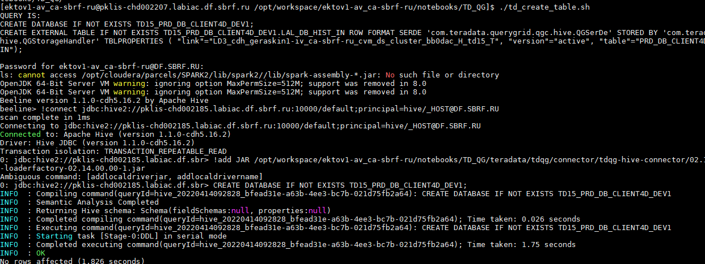
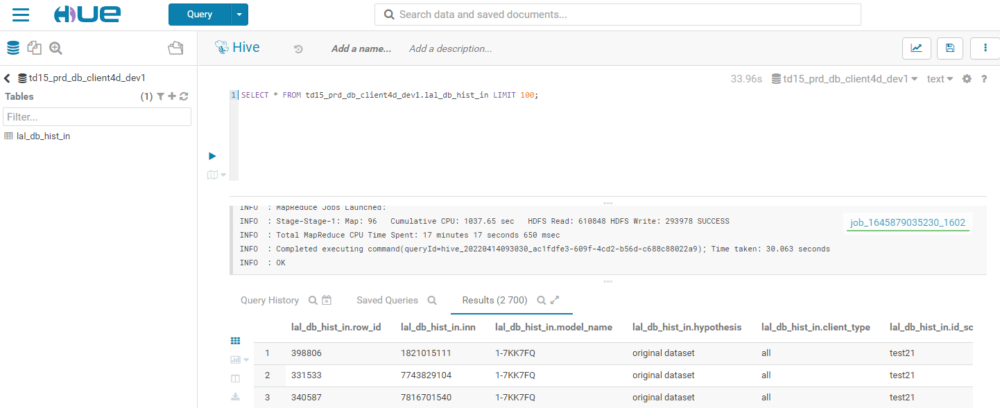

# HIVE EXTERNAL TABLE VIA HIVE-CONNECTOR TO TERADATA QUERY GRID ON THE BASE OF CLOUDERA HADOOP DISTRIBUTIVE

Provide the path to your local stored user password:
```bash
PASS=$(cat /home/$(whoami)/pass/userpswrd | sed 's/\r//g')
```
Connection is established through HiveServer vie beeline command-line utility. One should provide the valid host to the Hive2 server.
At the following function we're using
*pklis-chd002185.labiac.df.sbrf.ru:10000*
```bash
function runBeeline {
printf "$PASS" | kinit $(whoami)@$realm
beeline<<EOF
!connect jdbc:hive2://$HOSTNAME:10000/default;principal=hive/_HOST@${realm}
!add JAR /opt/workspace/${USER}/notebooks/TD_QG/teradata/tdqg/connector/tdqg-hive-connector/02.14.00.00-1/lib/hive-loaderfactory-02.14.00.00-1.jar
${1}
EOF
kdestroy
}
```
Also one should provide the full path to the *hive-loaderfactory-02.14.00.00-1.jar* connector between teradata QG and Hive. Here we use ADD JAR instruction
to help beeline load all nesessary java classes:
```bash
add JAR /opt/workspace/${USER}/notebooks/TD_QG/teradata/tdqg/connector/tdqg-hive-connector/02.14.00.00-1/lib/hive-loaderfactory-02.14.00.00-1.jar
```
User should fill `dbs` file according to the following notation {SCHEMA}.{TBL} providing tables of interest line by line.
Then running main shell script `td_create_table.sh` dbs file will be parsed and the following CREATE TABLE clause will be executed by beeline:
```sql
CREATE DATABASE IF NOT EXISTS TD15_${database};
CREATE EXTERNAL TABLE IF NOT EXISTS TD15_${database}.${table}
ROW FORMAT SERDE 'com.teradata.querygrid.qgc.hive.QGSerDe'
STORED BY 'com.teradata.querygrid.qgc.hive.QGStorageHandler'
TBLPROPERTIES ( \"link\"=\"${tdqg_link}\", \"version\"=\"active\", \"table\"=\"$database.$table\");"

In the case of successfull execution beeline will print the following termination RDBMS message into stdout.
```


After all instructions will be executed and commited successfully we can go to Hue and run query addressing to teradata using our created external table as proxy gate:

